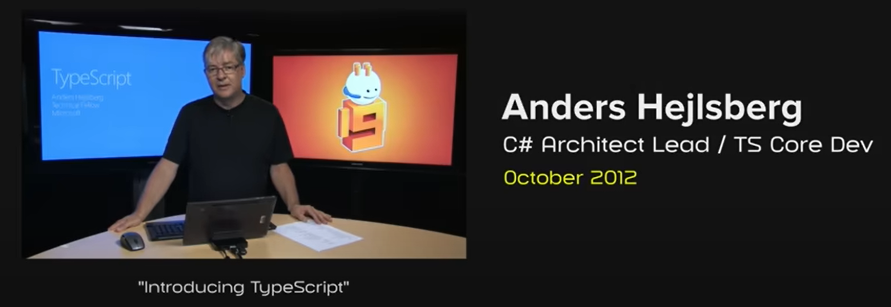

# Préambule

## Brise-glace

[Avez-vous une personnalité type safe ?](https://ladigitale.dev/digiquiz/q/68669144c9a4b)

## JavaScript et le typage dynamique

En JavaScript, les variables sont typées dynamiquement. Cela signifie que le type d'une variable est déterminé au moment de l'exécution, en fonction de la valeur qui lui est assignée. De plus, les variables peuvent être réassignées à un type différent.

```javascript
let variable = 42;
console.log(variable);

variable = "Maintenant je suis une chaîne";
console.log(variable);
```

Cette flexibilité peut être utile dans certaines situations, mais conduit souvent à des bugs qui auraient pu être évités si la variable avait eu un type cohérent.

L'autre problème majeur du typage dynamique est qu'il peut empêcher l'**inférence de type**. L'inférence de type est la capacité de l'analyseur de code de votre IDE à déterminer automatiquement le type d'une variable en fonction de son utilisation. C'est une fonctionnalité très utile de tout IDE moderne pour aider à détecter les erreurs dans votre code avant même qu'il ne soit exécuté.

```javascript
let variable = null;
if (condition) {
  variable = "Maintenant je suis une chaîne";
}

variable.toUpperCase(); // Erreur : variable pourrait être null
```

Enfin, être capable de définir le type d'une variable est un moyen de documenter votre code et de le rendre plus lisible. Dans les bases de code plus importantes, définir les interfaces et structures appropriées est essentiel pour s'assurer que le code est maintenable et évolutif.

Cela a conduit à la bonne pratique généralement acceptée d'utiliser des **annotations de type statiques** dans les grandes bases de code. Les annotations de type statiques signifient que le type d'une variable est défini explicitement au moment de la déclaration et ne peut pas être modifié par la suite. En TypeScript, ces annotations sont facultatives lorsque le type peut être inféré, mais vous aurez un avertissement pour chaque type ambigu.

## JSDoc pour le typage statique

Une alternative à TypeScript qui existe depuis bien plus longtemps est [JSDoc](https://jsdoc.app/). JSDoc est une convention basée sur les commentaires pour les annotations de type statiques qui est lue par l'IDE pour fournir une vérification de type supplémentaire et des informations de type sur votre code.

```javascript
/**
 * @param {number} a
 * @param {number} b
 * @returns {number}
 */
function add(a, b) {
  return a + b;
}

/** @type {(string|Array.<string>)} */
let path;
```

La force de JSDoc est qu'il peut être ajouté à n'importe quelle base de code JavaScript sans avoir besoin d'outil supplémentaire ou d'étape de compilation. C'est aussi un standard largement utilisé dans la communauté JavaScript.

Cependant, ce n'est pas le plus lisible et cela peut être fastidieux à écrire et maintenir. Cela crée une distance entre le code et les définitions de type, ce qui n'est pas la façon dont les développeurs travaillent ; vous déclarez généralement les variables et fonctions en même temps que vous déclarez leur type.

TypeScript a été créé pour fournir un moyen plus direct d'ajouter le typage statique à JavaScript, au prix d'une nouvelle extension de fichier et d'une étape de compilation. Il finit par être plus puissant et lisible que JSDoc, et il est maintenant largement adopté dans la communauté JavaScript.

## Histoire de TypeScript

TypeScript a été créé par un ingénieur logiciel de Microsoft, Anders Hejlsberg, qui est également connu pour son travail sur Turbo Pascal, Delphi et C#. Il a été [annoncé publiquement](https://www.youtube.com/watch?v=g48K9LEhHWs) par Microsoft en 2012 et la première version publique de TypeScript (0.8) a été publiée peu après.

TypeScript a été présenté comme un **sur-ensemble** du langage JavaScript conçu pour répondre aux lacunes de JavaScript, en particulier dans les grandes bases de code. En plus des annotations de type statiques, TypeScript a également ajouté plusieurs fonctionnalités qui n'étaient pas présentes en JavaScript à l'époque, telles que les classes, les modules et les interfaces. Les classes et modules ont été ajoutés au langage JavaScript depuis lors, dans ECMAScript 6 publié en 2015.



TypeScript est **compilé** en JavaScript en utilisant le compilateur `tsc` qui l'accompagne. Le compilateur vérifie tous les types, soulevant des erreurs si nécessaire, et compile également certaines des nouvelles fonctionnalités vers des versions JavaScript plus anciennes pour assurer la compatibilité avec les navigateurs plus anciens.

Au début, il a été reçu avec [scepticisme](https://arstechnica.com/information-technology/2012/10/microsoft-typescript-the-javascript-we-need-or-a-solution-looking-for-a-problem/) par la communauté JavaScript, car plusieurs autres sur-ensembles JavaScript ou alternatives avaient été proposés auparavant (CoffeeScript, Dart, GWT, etc.). Et l'idée d'ajouter une étape de compilation à JavaScript n'était pas très attrayante pour de nombreux développeurs.

Cependant, les avantages du typage statique sont devenus de plus en plus évidents, et TypeScript a continuellement gagné en popularité au fil des années. Le fait que ce soit un sur-ensemble du langage JavaScript au lieu d'un tout nouveau langage a beaucoup aidé à gagner en traction, car il est très facile de l'adopter de manière itérative. Il a été rapidement adopté par l'équipe Angular de Google, car [Angular 2 a été lancé avec TypeScript comme langage recommandé](https://devblogs.microsoft.com/typescript/angular-2-built-on-typescript/), aux côtés de Dart et JavaScript vanilla, pour ensuite décider de se concentrer uniquement sur TypeScript. Ensuite, d'autres frameworks web et bibliothèques ont suivi, et TypeScript est maintenant le standard de facto pour les grands projets JavaScript.

## État de TypeScript en 2025

Le langage a parcouru un long chemin depuis sa première version. L'équipe TypeScript a travaillé dur sur l'amélioration du système de types, en particulier pour l'inférence de type et la réduction de type.

Le compilateur a également évolué de manière significative depuis les premières versions, et supporte maintenant de nombreuses options et plugins pour personnaliser le processus de compilation. Aujourd'hui, de nombreuses alternatives au compilateur `tsc` existent, telles que `esbuild`, `swc` ou `oxc`, qui ont toutes de bien meilleures performances que `tsc`. Le temps de compilation est maintenant très rapide, même pour les grandes bases de code.

Enfin, [TypeScript a annoncé en mars 2025](https://devblogs.microsoft.com/typescript/typescript-native-port/) un **port natif du compilateur TypeScript** vers le langage Go, revendiquant une amélioration des performances de 10x par rapport au compilateur précédent. Il est encore en développement et est annoncé pour être publiquement publié dans TypeScript 7.0.


Concernant sa popularité, l'enquête [State of JS 2024](https://2024.stateofjs.com/en-US/usage/#js_ts_balance) montre que TypeScript est maintenant utilisé par la majorité des développeurs JavaScript, et 34% des développeurs JS ont déclaré écrire exclusivement du code TypeScript. Cette situation a été résumée par une expression récurrente dans la communauté : [_"TypeScript a gagné"_](https://www.youtube.com/watch?v=EUlM3wx546o).

Comme nous le verrons dans le chapitre suivant, TypeScript est maintenant supporté nativement par tous les runtimes JavaScript populaires, IDE et frameworks web. Les autres alternatives à TypeScript qui existaient (Flow, CoffeeScript) sont maintenant dépréciées ou ont une très faible utilisation. Seul JSDoc reste utilisé dans certaines bibliothèques et projets qui ne veulent pas ajouter une étape de compilation à leur workflow. Mais le support natif du code TypeScript pour Node.js va probablement le faire disparaître également dans les années à venir.

Il est également à noter que l'équipe TypeScript a travaillé sur la proposition d'[une proposition à TC39](https://devblogs.microsoft.com/typescript/a-proposal-for-type-syntax-in-javascript/), le comité technique en charge des évolutions du langage JavaScript. Cette nouvelle syntaxe est très proche de TypeScript mais ne consiste qu'en une syntaxe optionnelle et effaçable pour les annotations de type.

La syntaxe effaçable est également la direction globale que prend TypeScript, car de nombreux runtimes JavaScript supportant nativement le code TypeScript ne se donnent plus la peine d'effectuer la vérification de type, considérant que les IDE le font déjà au moment où le code est écrit, et que d'autres outils peuvent faire cette étape de validation au déploiement dans les pipelines CI/CD par exemple.
