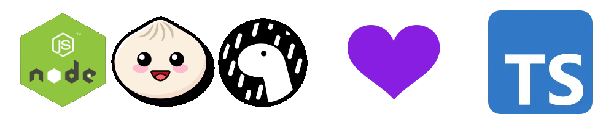
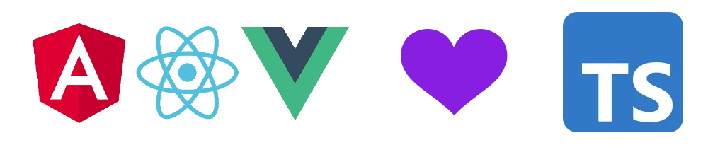

# Getting started

## Adding TypeScript to a project

### Node.js, Bun, Deno

Let's start with the good news. If you want to use TypeScript with a JavaScript runtime like [Node.js](https://nodejs.org) (version 23 minimum), [Bun](https://bun.sh) or [Deno](https://deno.land), they all have native support today 🥳



So you don't have anything to do in particular to use TypeScript in these environments. Just create your `.ts` files and run your code with the runtime you want.

::: warning

**Not all TypeScript features are supported by these runtimes**. Only **erasable syntax** is supported, which is the parts of the TypeScript syntax that can be removed without changing the behavior of the code. That excludes a few features like decorators, namespaces and enums.

That's why **we won't cover these features** during this training. To know more about these feature left behind, you can go to the [To go deeper](/to-go-deeper) section.

:::

### Browser

If you write some code that runs in a web browser though, you will need to compile your TypeScript code to JavaScript. This is because browsers don't understand TypeScript directly as it is not part of the web standards.

There is an official compiler, `tsc`, and other faster alternatives like `esbuild`, `swc` or `oxc` that are directly included in many web frameworks. All these compilers ran in JavaScript runtimes like Node.js, Deno or Bun.

#### Using the official tsc compiler

We'll assume you use Node.js and NPM in your project. If you don't, you can install Node.js from [nodejs.org](https://nodejs.org) and NPM will be installed with it.

Install the TypeScript compiler in your project:

```bash
npm install typescript --save-dev
```

Then you can compile your TypeScript code with the `tsc` command:

```bash
npx tsc
```

This will look for a `tsconfig.json` file in your project and compile all your TypeScript code according to the settings in this file. Every individual `.ts` file will be compiled to a `.js` file with the same name.

You can also specify a file to compile:

```bash
# Emit JS for just the index.ts with the compiler defaults
npx tsc index.ts
# Emit JS for any .ts files in the folder src, with the default settings
npx tsc src/*.ts
```

Since you are going to compile your TypeScript code every time you change it, you might want to add a `watch` flag to the `tsc` command:

```bash
npx tsc --watch
```

And you can also add it to your `package.json` npm scripts section:

```json
{
  "scripts": {
    "build": "tsc",
    "watch": "tsc --watch"
  }
}
```

Then you can run `npm run watch` to compile your TypeScript code every time you change it, and add `npm run build` to your CI/CD pipeline to compile your code before deploying it.

#### Using Vite, an all-in-one build tool

With [Vite](https://vitejs.dev), you can quickly set up a development environment for your TypeScript project. Vite provides a fast and efficient build process, leveraging native ES module support and other advanced features.

To start using Vite with TypeScript, follow these steps:

1. Init a Vite project with the vanilla (no framework) TypeScript template:

   ```bash
   npm init vite@latest my-app --template vanilla-ts
   cd my-app
   npm install
   ```

2. Run the development server:

   ```bash
   npm run dev
   ```

3. Vite will take care of compiling your TypeScript files and reloading the browser on changes.

::: info

Vite is using `esbuild` under the hood to compile TypeScript. It is very fast, but does not perform type-checking validations. So you need to either run `tsc` to do this type-checking job, or rely on your IDE to do it for you.

:::

## Support in web frameworks

Most of them have support for TypeScript and are written in TypeScript !



And all these frameworks recommend Vite as their build tool, so you should be good to go ! You can use one of the [Vite templates](https://github.com/vitejs/vite/tree/main/packages/create-vite#scaffolding-your-first-vite-project) to start a new TypeScript project with the framework of your choice.

## IDE Support

Most of the popular IDEs have support for TypeScript. [Visual Studio Code](https://code.visualstudio.com) is the most popular one and has the best support for TypeScript, since it is made by Microsoft as well. [Webstorm](https://www.jetbrains.com/webstorm/) is also a good choice if you prefer a more complete IDE in the Jetbrains ecosystem.

## TSConfig

The `tsconfig.json` file is the configuration file for the TypeScript compiler. It is used to specify compilation options and other settings for the TypeScript compiler. This file should be located in the root folder of your project.

Here is a recommended base configuration for your `tsconfig.json` file by Matt Pocock, a TypeScript devrel and content creator: [https://www.totaltypescript.com/tsconfig-cheat-sheet](The TSConfig Cheat Sheet by Matt Pocock)

The most important settings for all projects are these ones:

```json
{
  "compilerOptions": {
    "esModuleInterop": true,
    "skipLibCheck": true,
    "target": "es2022",
    "moduleDetection": "force",
    "verbatimModuleSyntax": true
  }
}
```

::: info

"es2022" can be replaced with "esnext" if you want to use the latest version of ECMAScript supported by TypeScript. Because ECMAScript evolves over time, this value doesn’t mean the same thing between different TypeScript versions, so usually people prefer to set it as a static value to make upgrades more predictable.

:::

## Checkpoint: run your first TypeScript program

Install the latest version of [Node.js](https://nodejs.org) if you haven't already. [Bun](https://bun.sh) or [Deno](https://deno.land) can also be used, but in this example we will use Node.js.

Then install TypeScript globally so you can use the `tsc` command:

```bash
npm install -g typescript
```

Create a file named `hello.ts` with the following content:

```typescript
const greeting: string = "Hello, TypeScript!";
console.log(greeting);
```

Then run the following command to compile it to JavaScript:

```bash
tsc hello.ts
```

Look at the generated `hello.js` file in the same folder. It should look like this:

```javascript
var greeting = "Hello, TypeScript!";
console.log(greeting);
```

This generated JavaScript code can be run with Node.js or inside a web browser. But you don't need to compile your TypeScript code to run it with Node.js, Bun or Deno! You can just run the `.ts` file directly:

```bash
node hello.ts
```

