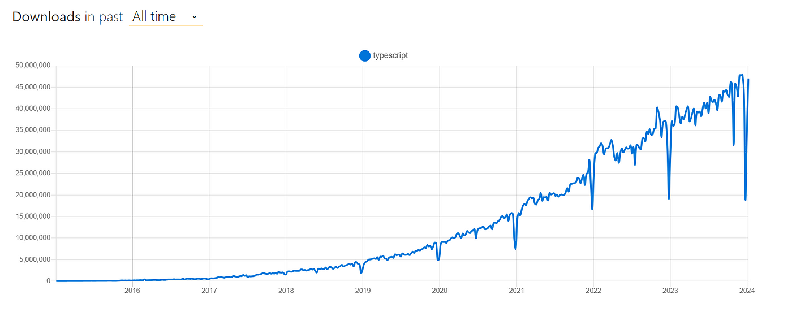

# Preamble

## JavaScript and dynamic typing

In JavaScript, variables are dynamically typed. That means that the type of a variable is determined at runtime, based on the value assigned to it. Moreover, variables can be reassigned to a different type.

```javascript
let variable = 42;
console.log(variable);

variable = "Now I am a string";
console.log(variable);
```

This flexibility can be useful in some situations, but often lead to bugs that could have been prevented if the variable had a consistent type.

The other major issue of dynamic typing is that it can prevent **type inference**. Type inference is the ability of the parser to automatically determine the type of a variable based on its use. It is a very useful feature of any modern IDE to help catch errors in your code before it is even run.

```javascript
let variable = null;
if (conditionOnRuntime) {
  variable = "Now I am a string";
}

variable.toUpperCase(); // Error: variable could be null
```

Finally, being able to define the type of a variable is a way to document your code and make it more readable. In larger codebases, defining the proper interfaces and structures is essential to ensure that the code is maintainable and scalable.

This led to the generally accepted best practice of using **static type annotations** in large codebases. Static type annotations mean that the type of a variable is defined explicitely at the time of declaration and cannot be changed afterward. In TypeScript, these annotations are optional when the type can be inferred, but you will get a warning on any ambiguous type.

## JSDoc for static typing

An alternative that exist for a much longer time than TypeScript is [JSDoc](https://jsdoc.app/). JSDoc is a comment-based convention for static type annotations that is parsed by the IDE to provide additional type-checking and type information on your code.

```javascript
/**
 * @param {number} a
 * @param {number} b
 * @returns {number}
 */
function add(a, b) {
  return a + b;
}

/** @type {(string|Array.<string>)} */
let path;
```

The strength of JSDoc is that it can be added to any JavaScript codebase without the need for any additional tool or compilation step. It is also a standard that is widely used in the JavaScript community.

However it's not the most readable and it can be cumbersome to write and maintain. It creates a distance between the code and the type definitions, which is not the way developers work ; you usually declare variables and functions at the same time you declare their type.

TypeScript was created to provide a more straight-forward way to add static typing to JavaScript, at the cost of a new file extension and a compilation step. It ends up being more powerful and readable than JSDoc, and it is now widely adopted in the JavaScript community.

## History of TypeScript

TypeScript was created by a software engineer at Microsoft, Anders Hejlsberg, who is also known for his work on Turbo Pascal, Delphi and C#. It was [publicly announced](https://www.youtube.com/watch?v=g48K9LEhHWs) by Microsoft in 2012 and the first public version of TypeScript (0.8) was released shortly after.

TypeScript has been presented as a **superset** of the JavaScript language designed to address the shortcomings of JavaScript, especially in large codebases. In addition to static type annotations, TypeScript also added several features that were not present in JavaScript at the time, such as classes, modules and interfaces. Classes and modules have been added to the JavaScript language since then, in ECMAScript 6 released in 2015.


TypeScript is **compiled** to JavaScript using the `tsc` compiler that came with it. The compiler performs type-checking validations, raising errors when necessary, and also compiled some of the new features to older JavaScript versions to ensure compatibility with older browsers.

At first, it was received with [skepticism](https://arstechnica.com/information-technology/2012/10/microsoft-typescript-the-javascript-we-need-or-a-solution-looking-for-a-problem/) by the JavaScript community, because several other JavaScript supersets or alternatives had been proposed before (CoffeeScript, Dart, GWT, etc.). And the idea of adding a compilation step to JavaScript was not very appealing to many developers.

However, the benefits of static typing became more and more apparent, and TypeScript continuously gained popularity over the years. The fatc that it was a superset to the JavaScript language instead of a brand new language has helped a lot to gain traction, because it is very easy to adopt it iteratively. It has been quickly adopted by the Angular team at Google, as [Angular 2 launched with primary support for TypeScript](https://devblogs.microsoft.com/typescript/angular-2-built-on-typescript/), Dart and vanilla JavaScript, but finally decided to focus on TypeScript only. Then, other web frameworks and libraries followed, and TypeScript is now the de facto standard for large JavaScript projects.

## State of TypeScript in 2025

The language has gone a long way since its first release. The TypeScript team has been working hard on improving the type system, especially for type inference and type narrowing.

The compiler also evolved significantly since the first versions, and now supports many options and plugins to customize the compilation process. Today, many alternatives to the `tsc` compiler exist, such as `esbuild`, `swc` or `oxc`, that all have much faster performance than `tsc`. The compilation time is now very fast, even for large codebases.

Finally, [TypeScript announced in March 2025](https://devblogs.microsoft.com/typescript/typescript-native-port/) a **native port of the TypeScript compiler** to Go language, claiming a 10x performance improvement over the previous compiler. It is still development and is announced to be publicly released in TypeScript 7.0.



Regarding its popularity, the [State of JS 2024](https://2024.stateofjs.com/en-US/usage/#js_ts_balance) survey shows that TypeScript is now used by the majority of JavaScript developers, and 34% of JS developers declared to exclusively write TypeScript code. This situation has been summed up by a recurring expression in the community: [_"TypeScript won"_](https://www.youtube.com/watch?v=EUlM3wx546o).

As we'll see in next chapter, TypeScript is now supported natively by all popular JavaScript runtimes, IDE and web frameworks. The other alternatives to TypeScript that existed (Flow, CoffeeScript) are now deprecated or have very low usage. Only JSDoc remains used in some libraries and projects that didn't want to add a compilation step to their workflow. But the native support of TypeScript code for Node.js is probably going to make it disappear as well in the coming years.

It is also worth noting that the TypeScript team has been working on pushing [a proposal to TC39](https://devblogs.microsoft.com/typescript/a-proposal-for-type-syntax-in-javascript/), the technical committee in charge of the evolutions of the JavaScript language. This new syntax is very close to TypeScript but only consists of optional and erasable syntax for type annotations.

Erasable syntax is also the global direction TypeScript is taking, since many JavaScript runtimes supporting natively TypeScript code don't bother anymore to perform type-checking, considering that the IDEs are doing it already at the time the code is written, and that other tools can do this validation step at deployment in CI/CD pipelines for example.
